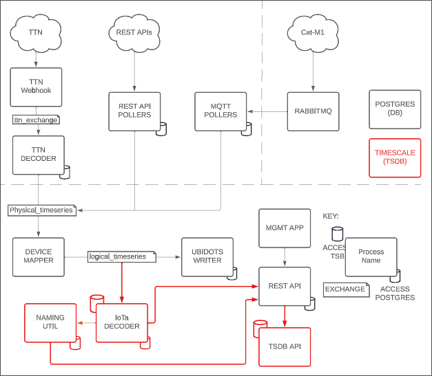
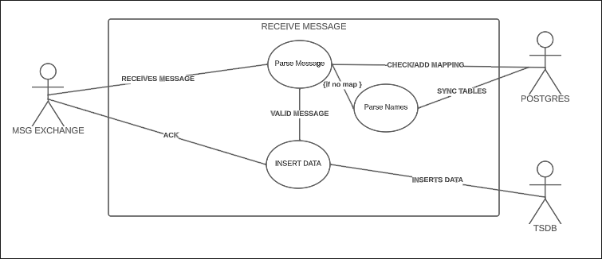
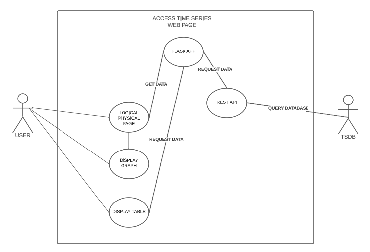
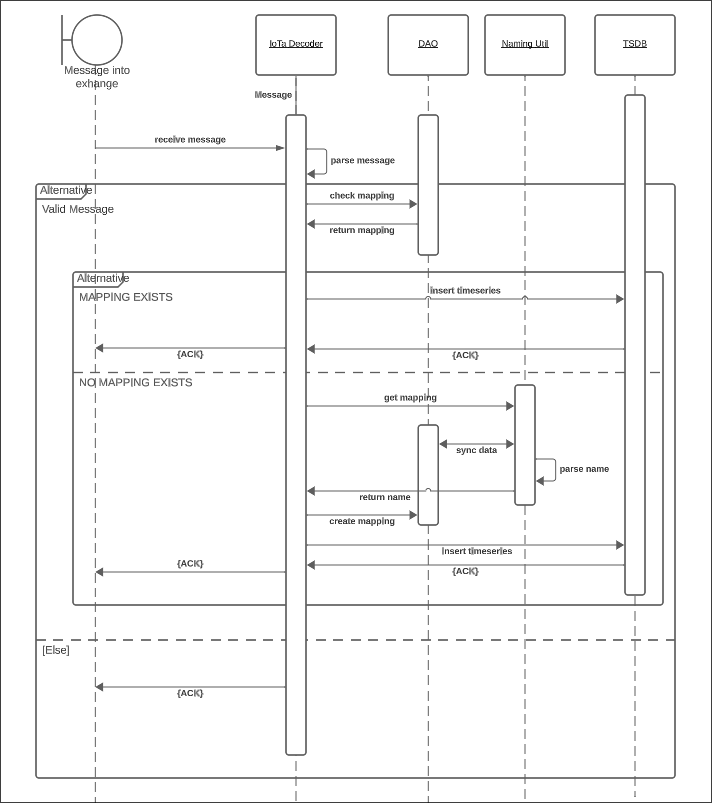
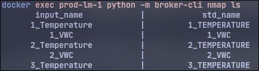
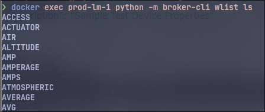
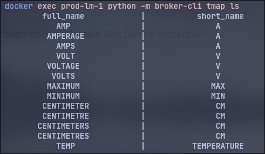

# Programmer Documentation
### Purpose: 
`	`The aim of this document is to act as a guide on how the system actually works, why it is implemented the way it is, and how to modify or maintain the system.
## ***Business Aims***
`	`The TSDB implementation aims to address to business requirements of:

- Storing incoming sensor data in an efficient and optimal way, that can be easily retrieved or backed up
- Compatibility with existing implementation, including allowing access and use to IoTa databases
- Local hosting of database, not cloud hosting
- Graphical representation of data with a web app
## ***Change List - Initial Merge into IoTa***
`	`Here is a complete list of the files we have changed or added, their reason for change and some notes on what might happen if it is changed.

|File|Change List|Reasons/Notes|
| :- | :- | :- |
|[compose/.env](https://github.com/ZakhaevK/itc303-team3-broker/blob/merge_dpi/compose/.env)|
Several new environment variables:

- TSDB\_USER

&emsp;- TSDB username

- TSDB\_PASSWORD 

&emsp;- TSDB password

- TSDB\_PORT

&emsp;- TSDB port

- TSDB\_HOST

&emsp;- TSDB host

- TSDB\_DB

&emsp;- TSDB database name

- TSDB\_TABLE

&emsp;- TSDB table name

- NAMING\_UPDATE\_INTERVAL

&emsp;- ` `interval (seconds) between the naming system checking for changes
|
- Changed existing file to keep project in one place.

- Required extra environment variables for TSDB implementation

- The TSDB\_XXX needs to match the equivalent in [compose/.tsdb_env](https://github.com/ZakhaevK/itc303-team3-broker/blob/merge_dpi/compose/.tsdb_env).
|
|[compose/.tsdb_env](https://github.com/ZakhaevK/itc303-team3-broker/blob/merge_dpi/compose/.tsdb_env)|
Several new environment variables:

- POSTGRES\_USER

&emsp;- TSDB username

- POSTGRES\_PASSWORD

&emsp;- TSDB pass

- POSTGRES\_PORT

&emsp;- TSDB port
|- Since Timescale is built on postgres, there was a conflict with both databases using the same .env file to set credentials. Had to split this up into a second file.|
|[compose/docker-compose.yml](https://github.com/ZakhaevK/itc303-team3-broker/blob/merge_dpi/compose/docker-compose.yml)|
Several new services:

- Iota\_tsdb\_decoder

&emsp;- Message handling and inserting into TSDB

- timescaledb

&emsp;- TSDB
|
- The decoder handles incoming MQ messages, and inserts them into TSDB.

- timescaledb is the actual time series database.
|
|[db/init.d/init_db.sql](https://github.com/ZakhaevK/itc303-team3-broker/blob/merge_dpi/db/init.d/init_db.sql)|
New Tables:

- data\_name\_map

&emsp;- Stores mappings to map incoming messages

- type\_name\_map

&emsp;- Stores types to dynamically process unmapped messages

- `word\_list`

&emsp;- Stores words to dynamically process unmapped messages

- hash\_table

&emsp;- Stores hash of tables to enable quicker syncing

Functions:

- update\_hash\_table

&emsp;- Create or update hash for table\_name

Triggers:

- type\_name\_map\_trigger

- word\_list\_trigger

&emsp;- Both the above trigger on any changes to the respected table, and call the update

Insertions:

- Inserts default values into data\_name\_map
|
- Efficient implementation of standardising the names for time series data

- Name maps are accessible by everything that has access to dao, or database.

- word\_list and type\_name\_map can be updated with containers running and will auto sync in a set period, without too much overhead.
|
|[timescale/init.sql](https://github.com/ZakhaevK/itc303-team3-broker/blob/merge_dpi/timescale/init.sql)|Creates the times series database schema|Requirement to set up the time series database.|
|[timescale/Dockerfile](https://github.com/ZakhaevK/itc303-team3-broker/blob/inc_backup/timescale/Dockerfile)|Used for custom timescaleDB images.|Main purpose is to install pgBackRest for physical backup into the timescale image.|
|[timescale/pgbr_init.sh](https://github.com/ZakhaevK/itc303-team3-broker/blob/inc_backup/timescale/pgbr_init.sh)|Added file.|Main purpose is to establish the stanza for pgBackRest so that physical backup can be performed.|
|[timescale/postgres/postgresql.conf](https://github.com/ZakhaevK/itc303-team3-broker/blob/inc_backup/timescale/postgres/custom_postgresql.conf)|Added file.|Required for configuration of postgres in use with pgBackRest.|
|[timescale/pgbackrest/pgbackrest.conf](https://github.com/ZakhaevK/itc303-team3-broker/blob/inc_backup/timescale/pgbackrest/pgbackrest.conf)|Added file.|Required for configuration of pgBackRest.|
|[src/python/broker-cli.py](https://github.com/ZakhaevK/itc303-team3-broker/blob/merge_dpi/src/python/broker-cli.py)|
Added logical device pretty output

Added several CRUD functions for:

- word\_list

- data\_name\_map

- type\_name\_map
|Physical devices had pretty output but logical devices did not|
|[src/python/api/client/DAO.py](https://github.com/ZakhaevK/itc303-team3-broker/blob/merge_dpi/src/python/api/client/DAO.py)|
New Functions:

- CRUD:

&emsp;- add\_name\_map

&emsp;- update\_name\_map

&emsp;- get\_std\_name

&emsp;- `\_get\_std\_name`
|Ability to access the new table correctly.|
|[src/python/pdmodels/Models.py](https://github.com/ZakhaevK/itc303-team3-broker/blob/merge_dpi/src/python/pdmodels/Models.py)|Added DataNameMap class|Following current structure for IoTa.|
|[src/python/restapi/TSDBAPI.py](https://github.com/ZakhaevK/itc303-team3-broker/tree/merge_dpi/src/python/restapi)|New file for implementing the time series API|
Uses same endpoint as existing REST API

Implements API requests for getting time series data from Timescale
|
|[src/python/restapi/requirements.txt](https://github.com/ZakhaevK/itc303-team3-broker/blob/merge_dpi/src/python/restapi/requirements.txt)|Added extra modules|
Some newer features needed extra modules to work.

Made setting up a local test environment Slightly easier by using file to install requirements
|
|[src/python/timescale/TS_LTSReader.py](https://github.com/ZakhaevK/itc303-team3-broker/blob/merge_dpi/src/python/timescale/TS_LTSReader.py)|Added file|This is the rabbit MQ message listener that receives and handles the incoming messages|
|[src/python/timescale/Timescale.py](https://github.com/ZakhaevK/itc303-team3-broker/blob/merge_dpi/src/python/timescale/Timescale.py)|Added file|This parses incoming messages into the timescale instance|
|[src/python/util/NamingConstants.py](https://github.com/ZakhaevK/itc303-team3-broker/blob/merge_dpi/src/python/util/NamingConstants.py)|Added file|
If messages come through and do not currently have a mapped name, they this module will generate the mapped name.

Uses word\_list, type\_name\_map and hash\_table to keep synced and dynamically create mapped names.
|
|[src/www/app/utils/api.py](https://github.com/ZakhaevK/itc303-team3-broker/blob/merge_dpi/src/www/app/utils/api.py)|
New functions:

- get\_between\_dates\_ts

- get\_luid\_ts

- get\_puid\_ts
|New functions pull from REST API to fill the web graph and web table data.|
|[src/www/app/main.py](https://github.com/ZakhaevK/itc303-team3-broker/blob/merge_dpi/src/www/app/main.py)|
New functions:

- parse\_ts\_table\_data

&emsp;- parses data in format for the web table

- parse\_ts\_data

&emsp;- parses data for format for the graph

- get\_data

&emsp;- actually flask endpoint to get data for web table

Modified functions:

- logical\_device\_form

&emsp;- added ts data variable that passes to the form

- logical\_device\_form

&emsp;- added ts data variable that passes to the form
|Required functions for providing time series data to the web app|
|[src/www/app/static/ts_graph.js](https://github.com/ZakhaevK/itc303-team3-broker/blob/merge_dpi/src/www/app/static/ts_graph.js)|Added file|
This is a bit of a template file, both p\_uid and l\_uid use it.

Generates graph with time series data
|
|[src/www/app/templates/ts_graph.html](https://github.com/ZakhaevK/itc303-team3-broker/blob/master/src/www/app/templates/ts_graph.html)|Added file|
This is a bit of a template file, both p\_uid and l\_uid use it.

This largely just passes on the time series data from flask to the graph.js file and handles the html side of things.

This page also references the ts\_table.js and handles displaying the graph.

The name should be refactored as it was created prior to the idea of a table being done.
|
|[src/www/app/static/ts_table.css](https://github.com/ZakhaevK/itc303-team3-broker/blob/merge_dpi/src/www/app/static/ts_table.css)|Added file|
Purely css for the time series template.

99% is for the ts\_table.js however, a small part may be for the show graph/table button that is always shown.
|
|[src/www/app/static/ts_table.js](https://github.com/ZakhaevK/itc303-team3-broker/blob/merge_dpi/src/www/app/static/ts_table.js)|Added file|
This handles the drawing and updating of the time series table.

It also uses js to insert the date pickers and buttons that the table uses.
|
|[src/www/app/templates/physical_device_form.html](https://github.com/ZakhaevK/itc303-team3-broker/blob/merge_dpi/src/www/app/templates/physical_device_form.html)|Added reference to ts\_graph.html template file|Added reference to the ts\_graph.js pages so time series can be used|
|[src/www/app/templates/logical_device_form.html](https://github.com/ZakhaevK/itc303-team3-broker/blob/merge_dpi/src/www/app/templates/logical_device_form.html)|
Added reference to ts\_graph.html template file

|Added reference to the ts\_graph.js pages so time series can be used|
|[/load-data.sh](https://github.com/ZakhaevK/itc303-team3-broker/blob/merge_dpi/load-data.sh)|Added file|
Useful script for adding and mapping some devices to test.

Creates user login

By default will create 10:10 p\_uid:l\_uid and map them 1:1.
|
|[/ts_backup.sh](https://github.com/ZakhaevK/itc303-team3-broker/blob/merge_dpi/ts_backup.sh)|Added file|Used for logical backup of the time series database|
|[/ts_restore.sh](https://github.com/ZakhaevK/itc303-team3-broker/blob/merge_dpi/ts_restore.sh)|Added file|Used to restore from a logical backup file|
|[/pgbr_backup.sh](https://github.com/ZakhaevK/itc303-team3-broker/blob/merge_dpi/pgbr_backup.sh)|- added file|Used for physical backup the time series database|
|[/pgbr_restore.sh](https://github.com/ZakhaevK/itc303-team3-broker/blob/merge_dpi/pgbr_restore.sh)|- added file|Used to restore from the physical backup files|
|[/pgbr_cleanup.sh](https://github.com/ZakhaevK/itc303-team3-broker/blob/merge_dpi/pgbr_cleanup.sh)|- added file|
Used for wiping and recreating PGBR data.

 Best used when following a logical restore.
|

## ***System Architecture***
### Design Philosophy:
- Keep as decoupled as possible, this will help:
  - Add future changes, and maintain the system.
  - Merging with IoTa and other ITC-303 projects without major breakages.
- Use of existing libraries - IoTa uses some existing libraries such as FastAPI to accomplish features, where possible we used the same libraries in order to keep IoTa maintainable and as simple as possible.
- Coding style - there is no stringent coding style used through IoTa, and so the TSDB changes mirror what is there, and follow PEP8 to some degree.
- The project should be able to be dropped/merged directly into current IoTa and not cause any issues, it only adds new features, it does not interfere or change existing mechanisms.

### Component Breakdown:
Key: **Green** = New File | **Purple** = Modified File

Timescale Database:

`	`Relevant Files:

1. [timescale/init.sql](https://github.com/ZakhaevK/itc303-team3-broker/blob/merge_dpi/timescale/init.sql)
1. [timescale/Dockerfile](https://github.com/ZakhaevK/itc303-team3-broker/blob/inc_backup/timescale/Dockerfile)
1. [compose/docker-compose.yml](https://github.com/ZakhaevK/itc303-team3-broker/blob/merge_dpi/compose/docker-compose.yml)

Purpose:

- (1) Defines the schema utilised by the Timescale database.
- (2) Specifies the base image, and the addition of pgBackRest for physical backup.
- (3) Modified to include Timescale database as part of the IoTa stack.

IoTa Timeseries Database Decoder:

Relevant Files:

1. [src/python/timescale/TS_LTSReader.py](https://github.com/ZakhaevK/itc303-team3-broker/blob/merge_dpi/src/python/timescale/TS_LTSReader.py)
1. [src/python/timescale/Timescale.py](https://github.com/ZakhaevK/itc303-team3-broker/blob/merge_dpi/src/python/timescale/Timescale.py)
1. [db/init.d/init_db.sql](https://github.com/ZakhaevK/itc303-team3-broker/blob/merge_dpi/db/init.d/init_db.sql)
1. [src/python/util/NamingConstants.py](https://github.com/ZakhaevK/itc303-team3-broker/blob/merge_dpi/src/python/util/NamingConstants.py)
1. [src/python/api/client/DAO.py](https://github.com/ZakhaevK/itc303-team3-broker/blob/merge_dpi/src/python/api/client/DAO.py) 

Purpose:

- (1) Accept JSON formatted messages from RabbitMQ containing time series data.
- (1) Confirm the data is in acceptable format, and contains no invalid data.
- (1) Convert data type names into standardised formats..
- (2) Provide a method of translation into a consumable format for the Timescale database.
- (2) Add valid data to the Timescale database.
- (3) Provides the standardised names used in translation within an SQL table added to the existing postgres database.
- (4) Provides the functions for finding and replacing data names with standardised names.
- (5) Extra functions to handle new tables in the existing postgres database.

REST API Addition:

`	`Relevant Files:

1. [src/python/restapi/TSDBAPI.py](https://github.com/ZakhaevK/itc303-team3-broker/tree/merge_dpi/src/python/restapi)

Purpose:

- (1) Provides several endpoints for retrieval of data from the Timescale database.
- (1) Is used by the Webapp for both the graph and table views.

Webapp Additions:

`	`Relevant Files:

1. [src/www/app/utils/api.py](https://github.com/ZakhaevK/itc303-team3-broker/blob/merge_dpi/src/www/app/utils/api.py)
1. [src/www/app/main.py](https://github.com/ZakhaevK/itc303-team3-broker/blob/merge_dpi/src/www/app/main.py)
1. [src/www/app/static/ts_graph.js](https://github.com/ZakhaevK/itc303-team3-broker/blob/merge_dpi/src/www/app/static/ts_graph.js)
1. [src/www/app/templates/ts_graph.html](https://github.com/ZakhaevK/itc303-team3-broker/blob/master/src/www/app/templates/ts_graph.html)
1. [src/www/app/templates/physical_device_form.html](https://github.com/ZakhaevK/itc303-team3-broker/blob/merge_dpi/src/www/app/templates/physical_device_form.html)
1. [src/www/app/templates/logical_device_form.html](https://github.com/ZakhaevK/itc303-team3-broker/blob/merge_dpi/src/www/app/templates/logical_device_form.html)
1. [src/www/app/static/ts_table.js](https://github.com/ZakhaevK/itc303-team3-broker/blob/merge_dpi/src/www/app/static/ts_table.js)
1. [src/www/app/static/ts_table.css](https://github.com/ZakhaevK/itc303-team3-broker/blob/merge_dpi/src/www/app/static/ts_table.css)

Purpose:

- (1) Provides functionality for pulling data that is used for the Webapp graph.
- (2) Integrates functionality from api.py for the Webapp graph.
- (3) Javascript for the Webapp graph, used in the templates of ID pages.
- (4) The HTML template file with the ts\_graph.js contained
- (5-6) Template device pages that import the graph HTML. 
- (7) Javascript for the Webapp table view, used by both p\_uid and l\_uid pages.
- (8) Styling for the time series section.

Timescale Backup:

`	`Relevant Files:

1. [/ts_backup.sh](https://github.com/ZakhaevK/itc303-team3-broker/blob/merge_dpi/ts_backup.sh)
1. [/ts_restore.sh](https://github.com/ZakhaevK/itc303-team3-broker/blob/merge_dpi/ts_restore.sh)
1. [/pgbr_backup.sh](https://github.com/ZakhaevK/itc303-team3-broker/blob/inc_backup/pgbr_backup.sh)
1. [/pbgr_restore.sh](https://github.com/ZakhaevK/itc303-team3-broker/blob/inc_backup/pgbr_restore.sh)
1. [timescale/postgres/postgresql.conf](https://github.com/ZakhaevK/itc303-team3-broker/blob/inc_backup/timescale/postgres/custom_postgresql.conf)
1. [timescale/pgbackrest/pgbackrest.conf](https://github.com/ZakhaevK/itc303-team3-broker/blob/inc_backup/timescale/pgbackrest/pgbackrest.conf)
1. [timescale/pgbr_init.sh](https://github.com/ZakhaevK/itc303-team3-broker/blob/inc_backup/timescale/pgbr_init.sh)

Purpose:

- (1) Bash script that performs a logical backup and stores them in /backups/.
- (2) Bash script that performs a logical restore when given an argument containing the backup name contained in /backups/
- (3) Bash script that performs a physical backup.
- (3) Needs an argument of either “full”, “incr” (incremental), or “diff” (differential).
- (4) Bash script for performing a physical restore, will provide options within the physical backup volume.
- (4) Contains a warning on limitations regarding postgres due to the timelines feature.
- (5) Config file for Timescale, only adjusted to account for stanza creation and PITR options.
- (6) Config file for pgBackRest, contains details regarding backup storage.
- (7) Initialises pgBackRest on container startup.
## ***Detailed Design***
Component Diagram:

Use Case Diagrams:

## ***Operation***
The additional features follow the design philosophy of the existing IoTa, such that any current user of the system should be able to just ‘use’ the new additions.

Operations can be broken down to a few main use cases, message handling, broker cli usage, API, web app and back up. These are highlighted below, with a breakdown of each component.

#### Message Handling
The message handling is almost entirely automated without any changes, or worries. A message is handled by interacting with the following systems:

1. TS\_LTSReader.py listens to the main LTS exchange BrokerConstants.LOGICAL\_TIMESERIES\_EXCHANGE\_NAME
1. Once a message is received by the exchange, TS\_LTSReader.on\_message will double check that the physical device exists.
   1. Note: it does not check for a valid mapping, as the sender LogicalMapper does this already.
1. TS\_LTSReader.py then uses Timescale.py to attempt to parse and store the message.
1. Timescale.py handles talking to existing postgres db via DAO to check for valid mappings, and if required, uses NamingConstants.py to generate a new mapping.
1. Then, timescaledb will confirm success upon storing the message.
1. TS\_LTSReader.py will print results of the message handling.

**Notes**:

- Various messages are logged to console, such as if mappings are found or created, if a message passes or fails, if a message is received/rejected.
- NamingConstants.py will also communicate with DAO for access to word\_list, type\_name\_map and hash\_table in order to be able to sync with latest tables, and dynamically standardise the names using data from the tables.
- The files excluding NamingConstants.py are self contained, and should not be accessed outside of the sending messages through RabbitMQ,

**Breakages**:

Doing these things will require further code changes otherwise aspects will break or not function as expected and at the very least will require you to check the code for potential breakages.

- Modifying the message IoTa message format will cause messages to be rejected.
- Removing the added tables word\_list, hash\_table, type\_name\_map, name\_map will cause breakages on various sections.
- Changes to certain DAO functions that handle checking p\_uid, or the above tables.
- Renaming any of the expected environment variables defined in either .env or tsdb\_env.env or if these two files are not synced with the same variables.

**Modifications:**

These changes may be considered in the future, and this is a rough idea on what requirements may be:

- Removing NamingConstants.py : as it is a standalone module, it would be rather trivial to delete the reference and single function call from Timescale.py
- Changing environment variables would have no effect on the system, as long as they are synced between the two .env files.
- Changing exchange name should be done through BrokerConstants.py - otherwise code will break.

#### BrokerCLI.py
Several additions have been added to broker-cli.py to aid in the usage of the new features.

These are solely CRUD functions for the new tables in the standard postgres database, and follow the same expectation of the existing function. 

The command names used are shorthand, where:*.docx|*.doc|*.docm
nmap = data\_name\_map (name\_map)

tmap = type\_name\_map (type\_map)

wlist = word\_list (word\_list)

These also have a list of default values, that are defined in sql.init file when the postgresdb gets created.

name\_map is the mapped names, incoming name -> outgoing name:

word\_list is any word to be broken down and split up, ie Temperature which would result in TemperatureTemperature123 == temperature\_temperature\_123

Examples:

type\_map is any type that can be broken down, it Voltage,Volts, Volt all could all equal V.

Examples:

Like existing functions, use --help for full usage

Example usage:

docker exec prod-lm-1 python -m broker-cli nmap add --in test --out TEST

docker exec prod-lm-1 python -m broker-cli nmap ls -w 40

docker exec prod-lm-1 python -m broker-cli tmap rm --in test

**Breakages**:

These changes can not be added / removed without any issues with running the IoTa app. They are not technically needed, as one can log into the database and add/remove things, however for convenience and some safety, using the cli is recommended.

There is a fix for print pretty device output, if this is removed then our ./load\_data.sh test script will fail.

**Modifications:**

- Changes to the DAO.py functions might affect the broker-cli.py functions, especially for ls commands.

#### Accessing Timescale Database
For direct access to the Timescale Database within its container (timescaledb), the only way is to make use of psql, a command line tool for interacting with PostgreSQL databases.

An example to gain access to the database within production mode would be as follows: 
docker exec -it prod-timescaledb-1 psql -U <username> -d <database name>

For querying the database, it’s recommended to use the API, but access in this way will allow for more specific queries than possible with the API.
#### Using API
The query API makes use of the same FastAPI endpoint as the existing RestAPI, but with a different URL Path. All query API calls are made through to the URL localhost:5687/query. The details of the API implementation can be found in the following files;

- src/python/restapi/TSDBAPI.py contains the API’s function implementation and respective endpoints
- src/python/restapi/RestAPI.py for a single line that links TSDBAPI to the main FastAPI instance.
  - This line can be changed to change the query endpoint, or to include authentication etc.

The functions that have been implemented in the API include:

- Query, available at /{query}: enables users to submit a query in PostgreSQL syntax, and results are returned on the home page. This endpoint is to be used for more specific queries, which cannot be handled by any other functions.
- Get l\_uid records, available at /l\_uid/{l\_uid}: enables users to gather all the records corresponding to a particular l\_uid. Optional query parameters for additional filtering include p\_uid, fromdate and todate, where dates should use the format DD/MM/YYYY hh:mm:ss.
- Get p\_uid records, available at /p\_uid/{p\_uid}: enables users to gather all the records corresponding to a particular p\_uid. Optional query parameters for additional filtering include l\_uid, fromdate and todate, where dates should use the format DD/MM/YYYY hh:mm:ss.
- Get l\_uid records for the last x (time), available at /l\_uid/{l\_uid}/last: enables users to gather all the records corresponding to a particular l\_uid for the last x period of time expressed through dedicated query parameters for years, months, days, hours, minutes and seconds. All arguments are optional, and if no value is provided, then default to 0. An example, to get all records for l\_uid = 9 for the last 2 days, one can submit the following queries:
  - /l\_uid/9/last/?days=2
  - /l\_uid/9/last/?hours=48
  - /l\_uid/9/last/?minutes=2880
  - /l\_uid/9/last/?seconds=172800
- Get p\_uid records for the last x (time), available at /p\_uid/{p\_uid}/last: enables users to gather all the records corresponding to a particular p\_uid for the last x period of time expressed through dedicated query parameters for years, months, days, hours, minutes and seconds. All arguments are optional, and if no value is provided, then default to 0. 
- Get l\_uid records by function, available at /l\_uid/{l\_uid}/{func}: enables users to gather all the records corresponding to a particular l\_uid and apply a relevant SQL function on the values received. Functions include sum, avg, max, min etc.
- Get p\_uid records by function, available at /p\_uid/{p\_uid}/{func}: enables users to gather all the records corresponding to a particular p\_uid and apply a relevant SQL function on the values received. Functions include sum, avg, max, min etc.
#### Using Web App
The web app changes consist of three five main parts:

- api.py to handle the calls to the REST API.
- main.py to handle communication between api.py and the html sections.
- ts\_graph.js & ts\_table.js that handle the logic of the time series graph or table.
- ts\_graph.html that handles the html layout of the graph and table, this is largely a template file that is added into the existing pages.
- ts\_table.css handles styling for the table, and related buttons.

The XXXX\_form.html pages in the existing web app have had a few lines added, which essentially is a few divs, and inside those, sources the ts\_graph.html template file.

Breakdown of graph:

- The graph uses chart.js for the library.
- On each form page, whether logical or physical, the app will query the last 30 days of time series for the respective p\_uid or l\_uid and pass it onto the html page, which in turn passes it onto the javascript code.
- As it auto loads, it will only ever draw 30 days max.
- The functions of the graph are relatively straight forward, where the main issue is making sure the data passed from the web app stays in the same format, as chart.js requires the data formatted a specific way.

Breakages of graph:

- If the data format must remain the same, otherwise it will need to be parsed into the correct format.
- toggle\_state is used to keep track of selecting all / none, so if you manually deselect every single node, then you have bypassed changing the state and must click the toggle button twice.

Breakdown of table:

- Table is more complex than graph, and therefore changes are considered more complex.
- Uses grid.js
- Loaded from ts\_graph.html template file
- Lazily loads today’s data once toggle to be visible
- When the table is created, it also creates the date pickers and buttons via javascript, these buttons are destroyed and re-created on table updates due to the way grid.js handles them.
- As the table uses the single endpoint on the Flask side, and a single API call, it requires the p\_uid or l\_uid and the device type to be passed through. It gets the device type through an empty div in the form page, i.e physical\_form has a div pd\_page, and it uses the existing uid passed from Flask for the existing app features.
- The handle\_csv\_btn() will convert and download the **displayed** table into CSV. This function can be simplified a little if you simply wanted to display all table data, not just the filtered results.
- It relies on the main.py parsing function to send the data in the correct format, which is a json object { “columns”: [], “data”: [] }.
- The fetch command to get the data from the javascript code is as follows;  /get\_between\_dates\_ts?dev\_type=${dev\_type}&uid=${uid}&from\_date=${from\_date}&to\_date=${to\_date}
- Where dev\_type is the type of page, uid is the p\_uid or l\_uid for the device, and from/to\_dates are the picker values.

Breakages of table:

- Changing the parsing function in main.py called parse\_ts\_table\_data will break the table results.
- Changing ts\_table.css will cause the table to display in unexpected ways.

Modifying Web app:

- The main change would be to extend the newer table functions such as being able to query between dates to the graph. At the moment the graph only pulls 30 days on load, then it can be filtered down to 1 day, this was to be efficient and seamless.
- Adding in a query box to the table section would not be too much modification, the only part that would need attention would be ensuring that the query results are always in the same format, either by limiting the structure of the query, using drop downs or increasing complexity of the parser.
#### Backing Up the Database
For logical backup, the only relevant files and directories are:

- ts\_backup.sh which performs a logical backup using pg\_dump and saves it to the /backup/ directory.
- ts\_restore.sh takes an argument of a backup file that exists within the backup directory, then restores from it.
- /backup/ the directory where logical backups are stored.

Physical backup is similar in its usage, but required a custom timescaledb image for installation of pgBackRest:

- pgbr\_backup.sh performs a backup using pgBackRest. Can be given an argument of full, incr, or diff to determine the type of physical backup.
- pgbr\_restore.sh provides all existing physical backups within the pgbackrest\_data volume, and restores from the chosen backup.
- pgbackrest\_data is a volume that is mapped to the /var/lib/pgbackrest/ directory of the timescaledb image. This is required for the purpose of having a temp container.
- pgbr\_cleanup.sh wipes all data in the pgbackrest\_data volume and re-creates necessary files. Helpful when you have performed a logical restore, as the data will be invalid due to pg\_dump not considering pgBackRest and timelines.

Files related to config and initialisation of pgBackRest:

- pgbr\_init.sh initialises the stanza of pgBackRest to allow for archiving of timescale data.
- Dockerfile sets up a custom timescale image with pgBackRest installed.
  - Both pgbr\_init.sh and custom\_postgresql.conf are moved to required locations within the image.
- pgbackrest.conf provides configuration for pgBackRest, such as: 
  - Logging (log-level-file/log-level-console)
  - Full backup retention (“repo1-retention-full=4” means 4 full backups are stored max)
  - pgBackRest storage (“repo1-path=/var/lib/pgbackrest”)
  - Path to timescale data (“pg1-path=/home/postgres/pgdata/data”)
- custom\_postgresql.conf provides configuration for timescaledb regarding specific backup archiving options.
  - “recovery\_target = immediate” disables PITR.

There are currently some limitations regarding physical backup that may not be avoidable:

- Upon performing a logical backup restore, all stored physical backup data is no longer valid.
  - This is due to a postgres feature called timelines, where logical backup does not care for this, and essentially starts a full new timeline, despite technically being valid at some point.
  - In the current state It is recommended to wipe the pgbackrest\_data volume following a logical restore using pgbr\_cleanup.sh, or delete the container and volume and restart the timescale container to allow for it to initialise again.
- With multiple backups, if you restore to an older one, backups taken after that restore point will no longer be valid, as a new timeline has been created.
- Any attempt to restore to an invalid timeline point will result in the database failing to startup, as it will detect this invalid config and will refuse to startup.
