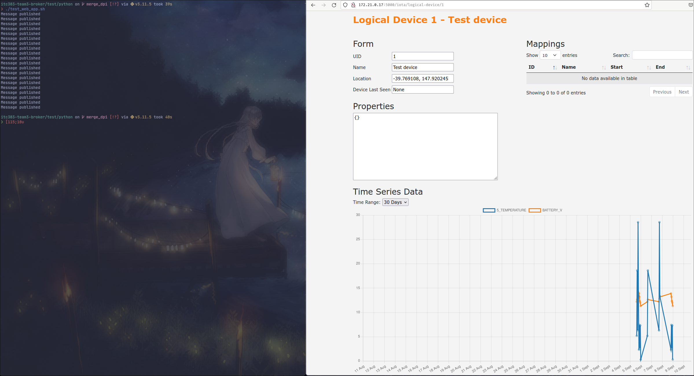

### IoTa: Time Series Database Testing Document
---

#### Purpose
- This document will highlight the requirements set forth in the project vision document and show the relevent test scripts, how to run them. It is possible that some of the requirements cannot clearly be shown through testing, however we can show through documentation or code that this requirement has been met.

#### Test Scripts
- Most scripts will require IoTa to be up and running. 
- Ideally only run the tests in a test environment as <b><u>data may be added or removed from the tsdb</u></b>
- Test scripts may need to be updated if hostnames, or other similar settings change.
- Test scripts are added into [test/python](https://github.com/ZakhaevK/itc303-team3-broker/tree/merge_dpi/test/python)
- all tests assume you're starting from the base directory ie: `/home/cal/303/itc303-team3-broker`

Test|Requires Running Instance|run commands|notes
|--|--|--|--|
[Integration Tests](https://github.com/ZakhaevK/itc303-team3-broker/blob/merge_dpi/test/python/TestIntegrationTSDB.py)|Yes|`cd test/python`<br>`python -m pytest -v TestIntegrationTSDB.py`|It will add some stuff to database.
[Retrieval/API Tests](https://github.com/ZakhaevK/itc303-team3-broker/blob/merge_dpi/test/python/TestTSDBAPI.py)|Yes|`./load_data.sh`<br>`cd test/python`<br>`python -m pytest -v TestTSDBAPI.py`|needs at least one device with puid and luid #1<br>inserts into database.
[Webapp time series graph](https://github.com/ZakhaevK/itc303-team3-broker/blob/merge_dpi/test/python/test_web_app.sh)|Yes|`./load_data.sh` <br> `cd test/python`<br>`./test_web_app.sh`|requires devices to exist with id 1, after running script head to the iota web app and check the physical or logical pages for time series data.<br>- hard coded dates, so ~9/10/23 will not show data as it is >30 days
[Standardised Naming](https://github.com/ZakhaevK/itc303-team3-broker/blob/merge_dpi/test/python/TestStdNaming.py)|No|`cd test/python`<br>`python -m pytest -v TestStdNaming.py`|you need to have to have python 3.10, and ideally most requirements so installing them from `../../src/python/restapi/requirements.txt` is easiest
---
#### Requirements Breakdown

##### Main Requirements:
Requirement|Test Script|Supported Document
|--|--|--|
Storage of time series data|[link](https://github.com/ZakhaevK/itc303-team3-broker/blob/merge_dpi/test/python/TestIntegrationTSDB.py)|[link](#storage-of-time-series-data)
Retrieval of time series data|[link](https://github.com/ZakhaevK/itc303-team3-broker/blob/merge_dpi/test/python/TestTSDBAPI.py)|[link](#retrieval-of-time-series-data)
Runs parallel with existing databases|No|[link](#runs-parallel)
No cloud hosting|No|[link](#cloud-hosting)
Backup and restore scripts|No|[link](#backup-and-restore)
Webapp additional web graph to visualise time series |[link](https://github.com/ZakhaevK/itc303-team3-broker/blob/merge_dpi/test/python/test_web_app.sh)|[link](#webapp-time-series-graph)
Compatibilty with existing IoTa implementation|No|[link](#iota-compatibility)
API to query database|[link](https://github.com/ZakhaevK/itc303-team3-broker/blob/merge_dpi/test/python/TestTSDBAPI.py)|[link](#api)

##### Other Requirements:
Requirement|Test Script|Supported Document
|--|--|--|
Access restricted to authorised users|No|[link](#security-practices)
Robust implementation|No|[link](#robust-implementation)
Accurately store and retrieve data|[link](https://github.com/ZakhaevK/itc303-team3-broker/blob/merge_dpi/test/python/TestIntegrationTSDB.py)|[link](#accurate-data)
System is at least as easy as existing implementation|No|[link](#easy-to-use)

---
#### IoTa Compatibility
- Existing systems have not been modified in any way that would affect their dependants.
- Some changes to existing sections have been added to, to ensure strong compaibility with IoTa.
- We have mirrored existing designs to try ensure consistency.
- See below table for a list of <i>some</i> of the changes to existing IoTa files and directories.

---
#### Storage of time series data
- Listener (TS_LTSReader.py) performs message handling in conjunction with Timescale.py for insertion.
- Messages that are not of IoTa message format, or contain invalid data will be dropped.
- Messages containing an ID pairing that does not exist within Device Mapper will be dropped.
- Time series data names are standardised prior to storage in the Timescale database as per [link](#robust-implementation).
- The TestIntegrationTSDB.py file tests this functionality, and passes as seen in the image below:


---
#### Retrieval of time series data
- The main method of retrieving the time series data is via API (covered in API section)
- Secondary way would be to query the database directly.
- The `../../compose/.tsdb_env` sets the database credentials
- The `../../compose/.env` also has the credentials, however these are for pulling the them rather than setting them to help maintain consistency.
- With the container running, see querying:
- `docker exec -it test-timescaledb-1 psql -U postgres -d postgres`


---
#### API
- the RestAPI uses same end points as existing api
- The TSDBAPI.py file provides the /query/ route for retrieval from TimescaleDB.
- The TestTSDBAPI.py file runs an automated test to confirm API functionality is working as expected.
- typically `0.0.0.0:5687/docs` to get full view of implementented features.
- main options are query database, get record by luid, puid, get by function and get by time.


---
#### Webapp Time Series Graph
- The time series graph uses chart.js
- Adds a time series graph at the bottom of each logical or physical device page.
- Allows 30 days, 7 days and 1 days selection and ability to enable or disable certain time series
- To run asscociated test script to check that this works as intended, head to `../../test/python/test_web_app.sh`
- and run `./test_web_app.sh` - it requires having a physical and logical device of #1 id in the system (you can easily do this by using `./load_data.sh` script)
- At this point you can go to webapp and click on puid or luid 1 and check bottom of page.





---
#### Logical Backup and Restore
- Only full backup is implemented.
- There are two scripts to handle this `../../ts_backup.sh` and `../../ts_restore.sh`
- They are pretty straight forward and quite verbose to ensure that user knows that scripts have run correctly without error.
- Backup data is in the form of chunks due to the hypertables of TimescaleDB used for optimisation.
- Further information on functionality is within the [user manual](https://docs.google.com/document/d/1Y9wej463ze6CFD0ZhA6pwCcQbC8DD6kX/edit?usp=drive_link&ouid=105542707453657000248&rtpof=true&sd=true).

---
#### Physical Backup and Restore
- Support full, incremental, and differential backup options
- There are two scripts to handle this `../../pgbr_backup.sh` and `../../pgbr_restore.sh`
- The pgbr_backup.sh file can be given arguments in command line, these include: full (full backup), incr (incremental), and diff (differential).
- Backup's take more space than logical component, but may be more suitable to frequent backups, and faster for larger sized DBs due to incremental option.
- Stores backup data in a volume called prod_pgbackrest_data.
- Care must be taken in restoring, as postgres timelines can incur errors if you restore to a backup that is not within the same timeline.
- Best use is to restore to the most recent backup, to prevent any timeline issues.
- Logical backup should be used to preserve important historical backups, and if used, timelines are destroyed. Recommended to delete all physical backups following logical restore.
- By default PITR is set off, but can be re-enabled within the timescale/postgres/custom_postgresql.conf file by removing, or changing the "recovery_target = immediate" line.
- Further information on functionality is within the [user manual](https://docs.google.com/document/d/1Y9wej463ze6CFD0ZhA6pwCcQbC8DD6kX/edit?usp=drive_link&ouid=105542707453657000248&rtpof=true&sd=true).

---
#### Cloud hosting
- All data is self hosted within docker compose stack via Timescale and existing Postgres database.
- It has been done in the same method as the existing postgresql db.

```
services:
  ...

  timescaledb:
    volumes:
      - tsdb_db:/var/lib/postgresql/ts_data

volumes:
  ...

  tsdb_db:
    external: true
```

---
#### Robust implementation
- Through the message handling process, generally things are wrapped in try catch blocks so that if a segment fails, then it will not block any new incoming messages
- We have standardised the naming of the time series data to ensure that data is consistant


---
#### Runs Parallel
- Below screenshot shows all running containers when IoTa is running, all the existing containers are running plus a few extra ones for the time series features.


---
#### Easy To Use
- As we have followed existing designs, using the new features should feel the same as using existing features.
- Running and configuring the environment has not changed, and there are no extra steps to follow.
- The time series stuff should work automatically - and Timescale has a solid documentation making understanding and extending features less of a hassle.

---
#### Accurate Data
- Throughout the implementation, we have been testing with a variety of automatically generated data which was derived from existing `iota.sql` real data.
- We have not been able to identify any instances of the database changing values.
- The database has a high degree of accuracy i.e: `28.521567509813398` where lopping sensor values should not cause issue.

---
#### Security Practices
- The time series database uses the same authentication as existing postgres database, this is because at it's core it is also a postgres database.
- All python scripts that require access to the database get access by reading the environment variables set in `../compose/.env` file.
