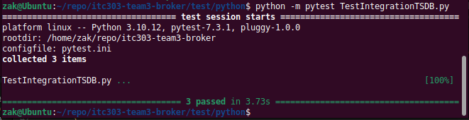
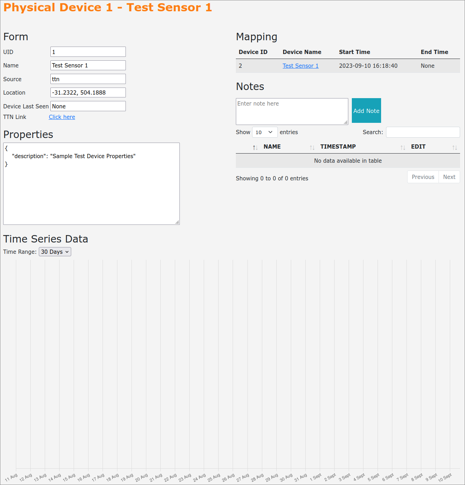
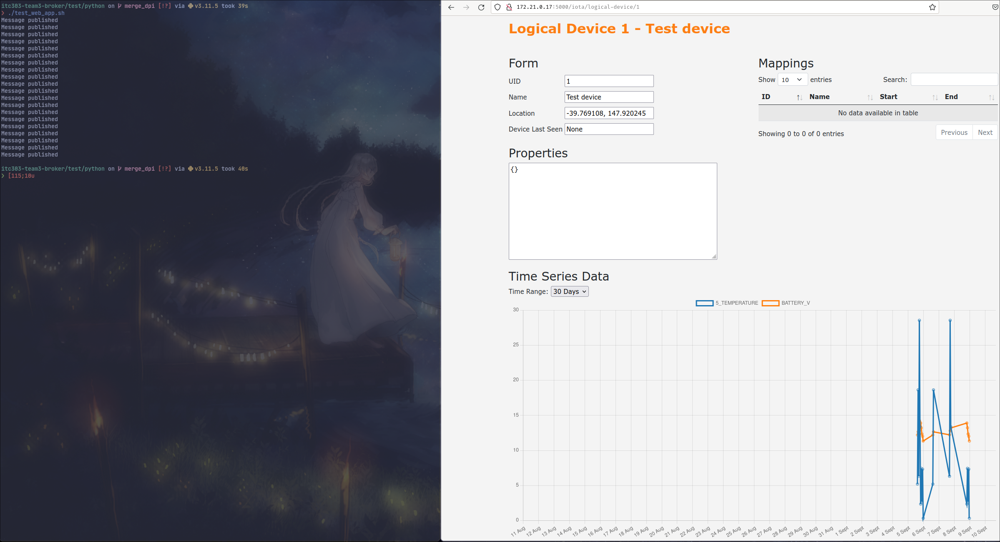
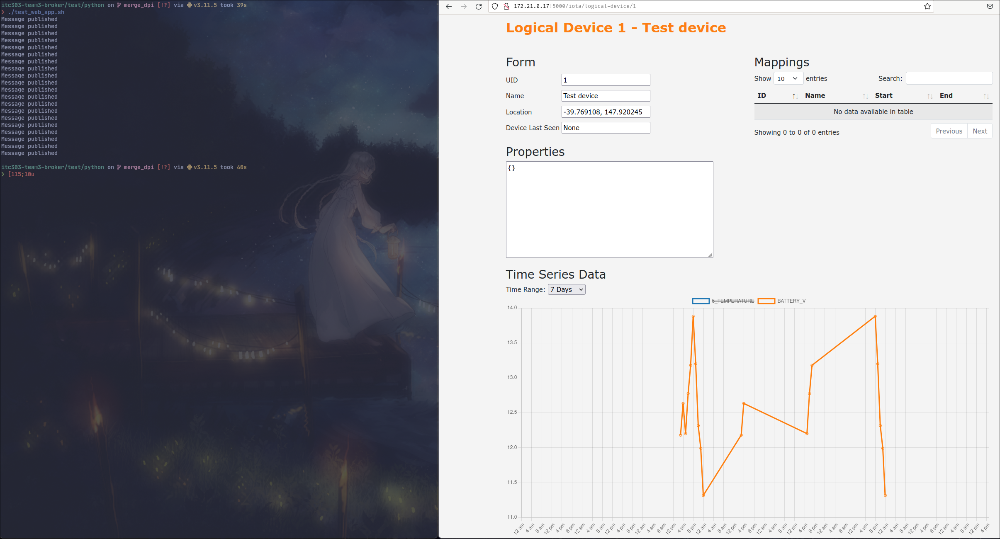
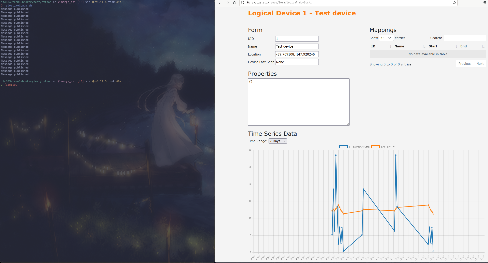
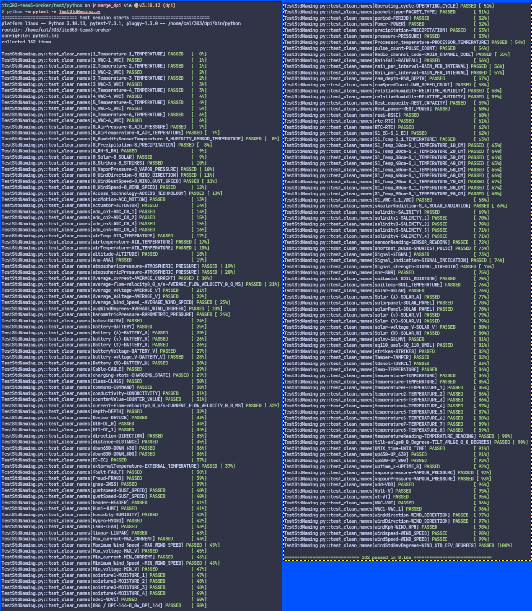
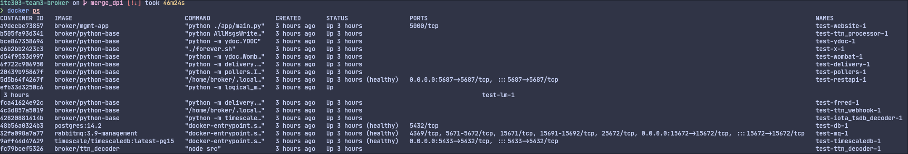

### IoTa: Time Series Database Testing Document
---

#### Purpose
&nbsp;&nbsp;&nbsp;&nbsp;&nbsp;&nbsp;This document will highlight the requirements set forth in the project vision document and show the relevent test scripts, how to run them. It is possible that some of the requirements cannot clearly be shown through testing, however we can show through documentation or code that this requirement has been met.

#### Test Scripts
- Most scripts will require IoTa to be up and running. 
- Ideally only run the tests in a test environment as <b><u>data may be added or removed from the tsdb</u></b>
- Test scripts may need to be updated if hostnames, or other similar settings change.
- Test scripts are added into [test/python](https://github.com/ZakhaevK/itc303-team3-broker/tree/merge_dpi/test/python)

Test|Requires Running Instance|run commands
|--|--|--|
[Webapp time series graph](https://github.com/ZakhaevK/itc303-team3-broker/blob/merge_dpi/test/python/test_web_app.sh)|Yes|`./load_data.sh` - creates devices <br> `./test/python/test_web_app.sh` - loads test time series data <br> `check webapp physical or logical device #1`

---
#### Requirements Breakdown

##### Main Requirements:
Requirement|Test Script|Supported Document
|--|--|--|
Storage of time series data|tbc|tbc
Retrieval of time series data|tbc|tbc
Runs parallel with existing databases|No|[link](#runs-parallel)
No cloud hosting|No|[link](#cloud-hosting)
Backup and restore scripts|tbc|tbc
Webapp additional web graph to visualise time series |[link](https://github.com/ZakhaevK/itc303-team3-broker/blob/merge_dpi/test/python/test_web_app.sh)|[link](#webapp-time-series-graph)
Compatibilty with existing IoTa implementation|No|[link](#iota-compatibility)

##### Other Requirements:
Requirement|Test Script|Supported Document
|--|--|--|
Access restricted to authorised users|No|tbc
Robust implementation|No|tbc
Accurately store and retrieve data|tbc|tbc
System is at least as easy as existing implementation|No|tbc

---
#### IoTa Compatibility
- Existing systems have not been modified in any way that would affect their dependants.
- Some changes to existing sections have been added to, to ensure strong compaibility with IoTa.
- We have mirrored existing designs to try ensure consistency.
- See below table for a list of <i>some</i> of the changes to existing IoTa files and directories.

File|Changes|Reasons
|--|--|--|
[compose/docker-compose.yml](https://github.com/ZakhaevK/itc303-team3-broker/blob/merge_dpi/compose/docker-compose.yml)|- added timescaledb, iota_tsdb_decoder services<br>|- additional services to meet requirements
|[compose/.env](https://github.com/ZakhaevK/itc303-team3-broker/blob/merge_dpi/compose/.env)|- added TSDB_XXX settings<br>|-trying to match existing .env structure. This is what the python applications use to login with, it does <u>not</u> set the database up.
[compose/.tsdb_env](https://github.com/ZakhaevK/itc303-team3-broker/blob/merge_dpi/compose/.tsdb_env)|-added file that contains tsdb POSTGRES credentials|- since Timescale is built on postgres, there was a conflict with both databases using same .env file to set credentials. Had to split this up into a second file.
[db/init.d/init_db.sql](https://github.com/ZakhaevK/itc303-team3-broker/blob/merge_dpi/db/init.d/init_db.sql)|-added extra table `data_name_map`<br>- added insert into `data_name_map` of standard values|- Efficient implementation of standardising the names for time series data<br>- Name maps are accessable by everything that has access to dao, or database.
[timescale/init.sql](https://github.com/ZakhaevK/itc303-team3-broker/blob/merge_dpi/timescale/init.sql)|-creates `timeseries` table<br>- sets schema up|- requirement to set up the time series database
[src/python/broker-cli.py](https://github.com/ZakhaevK/itc303-team3-broker/blob/merge_dpi/src/python/broker-cli.py)|- added logical device pretty output|- physical devices had pretty output but logical devices did not
[src/python/api/client/DAO.py](https://github.com/ZakhaevK/itc303-team3-broker/blob/merge_dpi/src/python/api/client/DAO.py)|- added CRUD for new table `data_name_map`|- ability to access the new table correctly.
[src/python/pdmodels/Models.py](https://github.com/ZakhaevK/itc303-team3-broker/blob/merge_dpi/src/python/pdmodels/Models.py)|- Added `DataNameMap` class|- following current structure for IoTa.
[src/python/restapi/TSDBAPI.py](https://github.com/ZakhaevK/itc303-team3-broker/tree/merge_dpi/src/python/restapi)|- new file for implementing the time series API|- uses same end point as existing RESTAPI<br>- implements API requests for getting time series data from Timescale
[src/python/restapi/requirements.txt](https://github.com/ZakhaevK/itc303-team3-broker/blob/merge_dpi/src/python/restapi/requirements.txt)|- added extra modules|- some newer features needed extra modules to work.<br>- made setting up a local test enviornment slightly easier by using file to install requirements
[src/python/timescale/TS_LTSReader.py](https://github.com/ZakhaevK/itc303-team3-broker/blob/merge_dpi/src/python/timescale/TS_LTSReader.py)|- added file|- this is the rabbit mq message listener that receives and handles the incoming messages
[src/python/timescale/Timescale.py](https://github.com/ZakhaevK/itc303-team3-broker/blob/merge_dpi/src/python/timescale/Timescale.py)|- added file|- this parses incoming messages into the timescale instance
[src/python/util/NamingConstants.py](https://github.com/ZakhaevK/itc303-team3-broker/blob/merge_dpi/src/python/util/NamingConstants.py)|- added file|- this handles the name_map parsing and standardises the names<br>- the word split and word expansions are currently hardcoded into file, however if required this can be changed.
[src/www/app/utils/api.py](https://github.com/ZakhaevK/itc303-team3-broker/blob/merge_dpi/src/www/app/utils/api.py)|- added ability to time series data|- required time series data for web graph
[src/www/app/main.py](https://github.com/ZakhaevK/itc303-team3-broker/blob/merge_dpi/src/www/app/main.py)|- added time series data requests via api.py|- required time series data for web graph pages
[src/www/app/static/ts_graph.js](https://github.com/ZakhaevK/itc303-team3-broker/blob/merge_dpi/src/www/app/static/ts_graph.js)|- added file |- this is the time series graph, both puid and luid use it
[src/www/app/templates/ts_graph.html](https://github.com/ZakhaevK/itc303-team3-broker/blob/master/src/www/app/templates/ts_graph.html)|- added file|- template for puid and luid pages to add the graph
[src/www/app/templates/physical_device_form.html](https://github.com/ZakhaevK/itc303-team3-broker/blob/merge_dpi/src/www/app/templates/physical_device_form.html)|- added reference to ts_graph.js|- adds time series graph to page
[src/www/app/templates/logical_device_form.html](https://github.com/ZakhaevK/itc303-team3-broker/blob/merge_dpi/src/www/app/templates/logical_device_form.html)|- added reference to ts_graph.js|- adds time series graph to page
[/load-data.sh](https://github.com/ZakhaevK/itc303-team3-broker/blob/merge_dpi/load-data.sh)|- added file|- useful script for adding and mapping some devices to test 


---
#### Storage of time series data
- Listener (TS_LTSReader.py) performs message handling in conjunction with Timescale.py for insertion.
- Messages that are not of IoTa message format, or contain invalid data will be dropped.
- Messages containing an ID pairing that does not exist within Device Mapper will be dropped.
- Time series data names are standardised prior to storage in the Timescale database as per [link](#robust-implementation).
- The TestIntegrationTSDB.py file tests this functionality, and passes as seen in the image below:



---
#### Webapp Time Series Graph
- The time series graph uses chart.js
- Adds a time series graph at the bottom of each logical or physical device page.
- Allows 30 days, 7 days and 1 days selection and ability to enable or disable certain time series
- To run asscociated test script to check that this works as intended, head to `../../test/python/test_web_app.sh`
- and run `./test_web_app.sh` - it requires having a physical and logical device of #1 id in the system (you can easily do this by using `./load_data.sh` script)
- At this point you can go to webapp and click on puid or luid 1 and check bottom of page.






---
#### Cloud hosting
- All data is self hosted within docker compose stack via Timescale and existing Postgres database.

[docker-compose.yml](https://github.com/ZakhaevK/itc303-team3-broker/blob/master/compose/docker-compose.yml)
```
    volumes:
      #- ../timescale/data:/var/lib/postgresql/data # Named volume in repo folder, had permission issues
      #- timescale_data:/var/lib/postgresql/data # Names volume in local root, permissions fine, needed manual deletion.
      - /var/lib/postgresql/data
      - ../timescale/init.sql:/docker-entrypoint-initdb.d/init.sql
```

---
#### Robust implementation
- Through the message handling process, generally things are wrapped in try catch blocks so that if a segment fails, then it will not block any new incoming messages
- We have standardised the naming of the time series data to ensure that data is consistant



---
#### Runs Parallel
- Below screenshot shows all running containers when IoTa is running, all the existing containers are running plus a few extra ones for the time series features.


